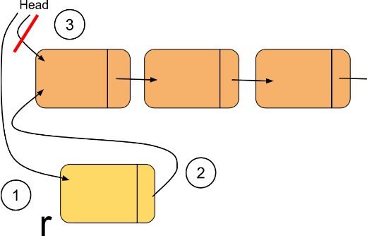
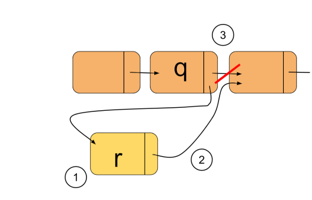
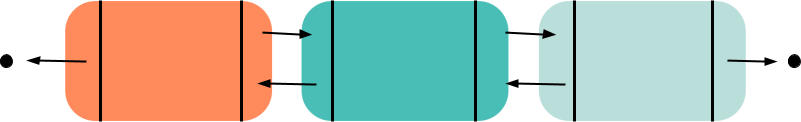

# myDSL | My Data Structure Library
This program was created to practice data structures in C++.
Some of the data structures this header contains:
* Linked List (Double & Single)
* Trees, Tries and Graph
* Stack and Queue
* Heap
* Hash Table


## Single Linked List


A linked list is a linear collection of data elements, called nodes, each pointing to the next node by means of a pointer.
It is one of the simplest and most common data structures.

The first node in a linked list is known as the head and the last is the tail. The tail points to nothing (NULL) representing the end of a list, depicted by a black dot.

```c++
class SingNode {    //Node class for single linked list
    private:
        int data;   //The data that the node holds
        SingNode* next;     //A pointer to the next node of the list
    public:
        SingNode(int d, SingNode* n = NULL) {   //default constructor
            data = d;
            next = n;
        }
    friend class SingList;  //Allows the SingList class to use SingNode
};
```

The `SingList` class creates the list, it uses the nodes to form the structure. It only uses two variables which are the `head` and `tail`. The other functions are various operations that can be preformed on the list.

```c++
class SingList {
    private:
        SingNode* head;
        SingNode* tail;
    public:
        .......
    bool IsEmpty() const;   //checks if the node is empty
    int getHead() const;    //returns the value at the head of the list
    int getTail() const;    //returns the value at the tail of the list
    void addEmpty(int v);   //adds a node to a empty list
    void addtoHead(int v);  //adds a node and turns it into new head
    void addtoTail(int v);  //adds a node and turns it into new tail
        .......
};
```

### Notable Operations
Some of the operations I am going to expand upon and go into a more in-depth explanation.
#### addtoHead
The beginning of the operation is not too excited, a simple if statement to see if the list is empty to begin with. But the else statment we will look close at.
```c++
    SingNode* r = new SingNode(v);
    r->next = head;
    head = r;
```
Here we see that we create a new node that holds the value the function was given. We then use the new node's pointer to point to the old head node of the list. Lastly we change the head to the new node, thus changing the head of the list. Below is a image of the process to visualize it better.

1. We create a new node, it doesn't point to anything it just holds the value inside of it for now
2. The new node's next pointer now points to the location of the previous head of the list.
3. Finally, make the new node the head of the list.



Now we can use this operation to add any node to a list from the front.

#### addAfter
This operation allows for us to find a node in a list and add an node right after it. This can come in handy for when we need to append an element to a list.
```c++
    SingNode* r = new SingNode(v);
    r->next = q->next;
    q->next = r;
```
Again we create a new node r with the value given in the function call. The new node then points to what the given node q points to, and then the given node q points to the new node, finishing the operation.

1. Create the new node that we call r
2. The next pointer of the node r, now points to the node that q pointed to.
3. Then make the node q point to the new node r



In any case that we need to append or add a node to a certain location in the list, we will probably use this operation.

## Double Linked List



A double linked list is a linear collection of data elements, called nodes, much like a single linked list but instead each node points to the previous and next node by the means of pointers.
The `previous` of the head and the `next` of tail has `NULL`. The in an empty list, both `head` and `tail` are `NULL`


This linked list uses slightly different nodes since the list is able to be navigated from the first element to the last and vice versa.
```c++
class Node {            //Node class for double linked list
    private:
        int data;       //variable for data in the node
        Node* next;     //pointer towards the next node in the list
        Node* prev;     //pointer towards the previous node in the list
    public:
        Node(int d, Node* n = NULL, Node* p = NULL) {   //Constructor
            data = d;
            next = n;
            prev = p;
        }
    friend class List;  //allows for the List class to utilize the node
};
```

