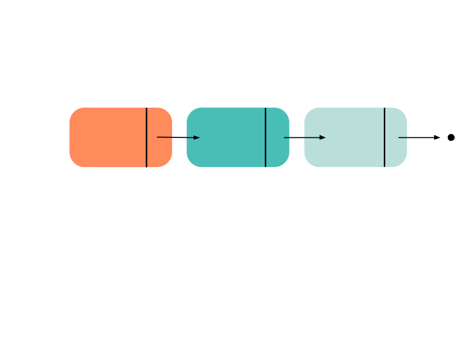

# myDSL | My Data Structure Library
This program was created to practice data structures in C++.
Some of the data structures this header contains:
* Linked List (Double & Single)
* Trees, Tries and Graph
* Stack and Queue
* Heap
* Hash Table

## Single Linked List



A linked list is a linear collection of data elements, called nodes, each pointing to the next node by means of a pointer.
It is one of the simplest and most common data structures.

The first node in a linked list is known as the head and the last is the tail. The tail points to nothing (NULL) representing the end of a list, depicted by a black dot.

```c++
class SingNode {
    private:
        int data;
        SingNode* next;
    public:
        SingNode(int d, SingNode* n = NULL) {
            data = d;
            next = n;
        }
    friend class SingList;
}
```

## Double Linked List

